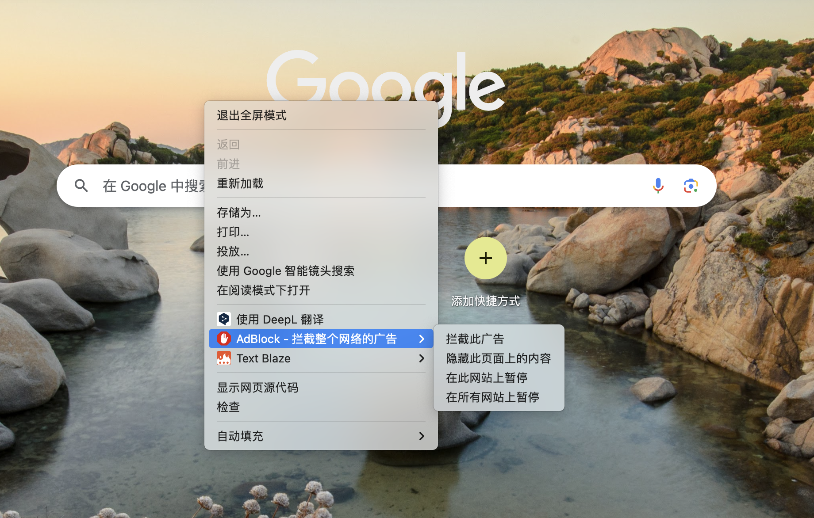
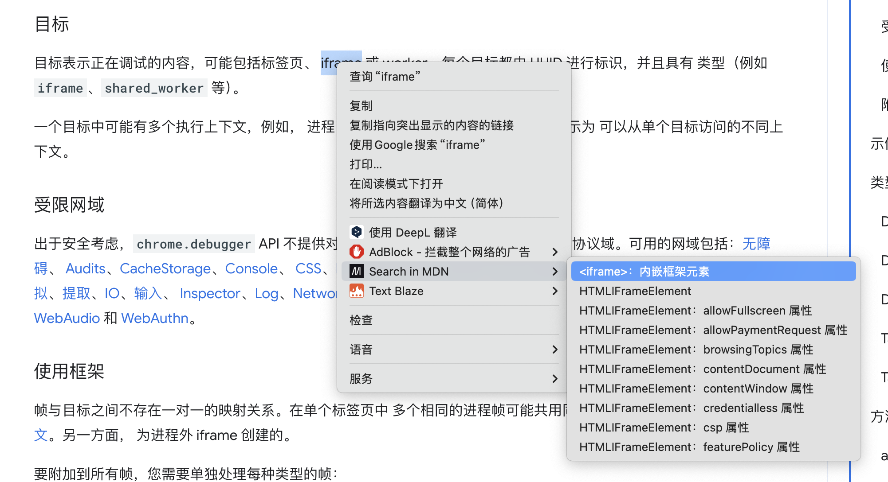

## Context Menu

就是右键菜单，可以向其新增 item 以及二级 item

```json
{
  "permissions": ["contextMenus"],
}
```



---

可以区分更多场景来扩展菜单


- page Tab 页面
- frame `iframe`
- link 链接 `<a>` 标签右键出现
- image 图片
- video 视频
- audio 音频
- selection 选中文字
- editable 可编辑元素
- launcher 浏览器操作（browser action）按钮的右键菜单中。
- browser_action 等同于 launcher，向后兼容而保留。
- page_action 页面操作（page action）按钮的右键菜单中。
- action 插件图标右键
- all 所有场景

---

<div class="flex items-start justify-between gap-8">

<div class="flex-1">

```js {4-10,14,17,18}
chrome.runtime.onMessage.addListener((message) => {
  const result = await search(selection)
  result.forEach((index) => {
    chrome.contextMenus.create({
      parentId: ExtensionMenuId,
      id: index.item.url,
      title: index.item.title,
      type: 'normal',
      contexts: ['selection'],
    })
  })
})

chrome.contextMenus.onClicked.addListener((info, tab) => {
  const index = tab!.index + 1
  const menuItemId = String(info.menuItemId)
  chrome.tabs.create({ url, index })
})
```

</div>

<div class="flex-1">
  
</div>

</div>
