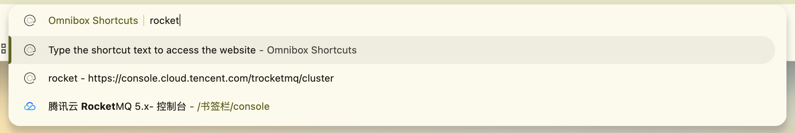
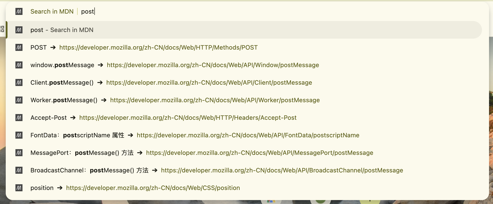

## Omnibox

就是地址栏，官方文档中称其为多功能框，可以设定关键词激活扩展程序接管输入行为

```json
{
  "omnibox": {
    "keyword": "mdn"
  }
}
```



---

<div class="flex items-start justify-between gap-8">

<div class="flex-1">

比如想实现快捷搜索 MDN 文档并打开

1. 了解 MDN 是如何搜索的
2. 提供选项到 Omnibox
3. 支持直接跳转

</div>

<div class="flex-1">

```js {1,4,7-10,12,14,16-18}
chrome.omnibox.onInputChanged.addListener(async function (text, suggest) {
  const result = await search(text)
  suggest(
    result.map((index) => {
      const { title, url } = index.item
      return {
        content: title,
        description: `${highlight(title, text)}`,
      }
    })
  )
})
chrome.omnibox.onInputEntered.addListener((content) => { /** update */})
```

</div>

</div>


