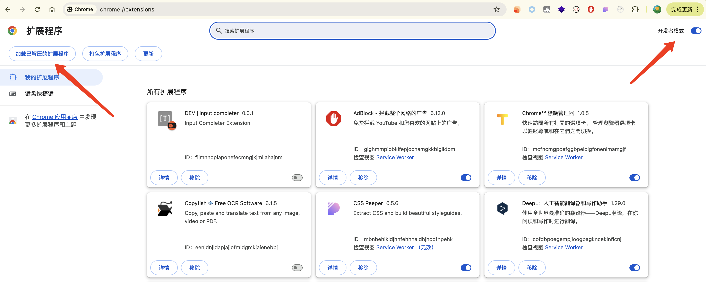

## Popup

只需要提供配置

```json
{
  "action": {
    "default_popup": "popup.html"
  }
}
```

在点击插件图标时即可弹出窗口展示 popup.html 内容

---

## 加载开发扩展程序

1. 打开 chrome://extensions/ 页面。
2. 开启开发者模式。
3. 点击“加载未打包的扩展程序”，选择扩展程序文件夹。


