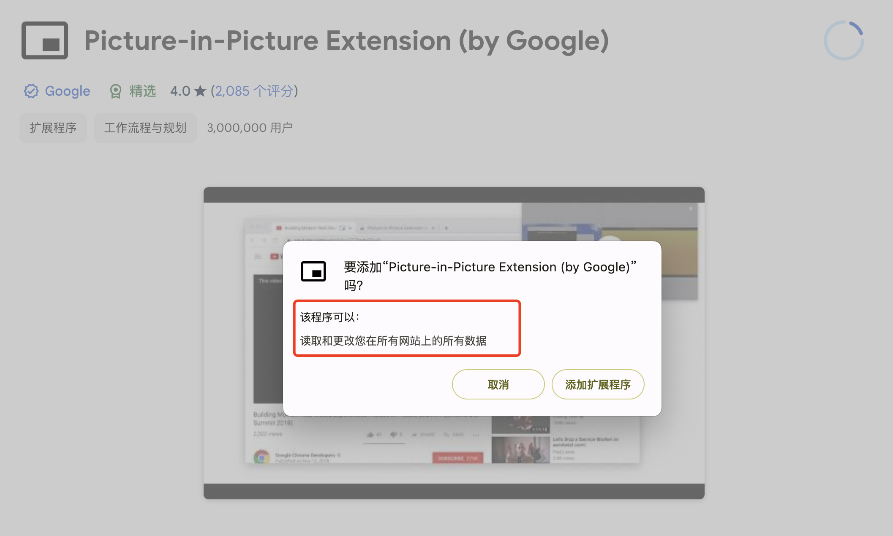
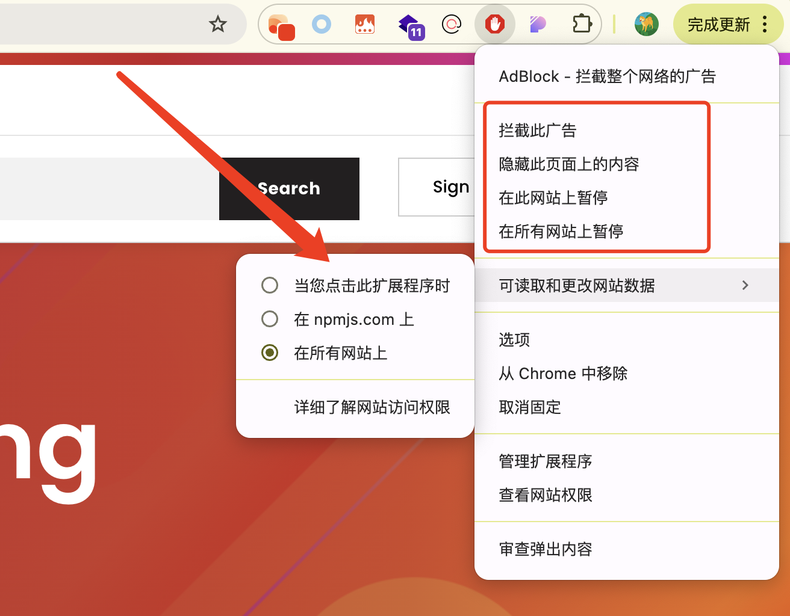

# 安全问题

## CSP 内容安全策略

默认情况下，插件只能从自己目录加载资源，相当于有默认配置

```json
{
  "content_security_policy": {
    "extension_pages": "script-src 'self'; object-src 'self"
  }
}
```

并且由于扩展程序属于高权限环境，因此不支持配置 `unsafe-eval`，拥有动态执行代码能力的代码都被禁用

- `eval(String)`
- `new Function(String)`
- `setTimeout(String)`
- `setInterval(String)`

---
---

# Sandbox

如果必须使用的话，并不是没有办法，还是举例说明，比如有一个弹出窗口中的计算器，输入计算公式，点击计算即可得到结果

```json
{
  "sandbox": {
    "pages": ["sandbox.html"]
  }
}
```

提供 sandbox.html 然后通过 iframe 加载并通信（在 sandbox 中被禁止调用诸如 `chrome.*` 的任何浏览器扩展程序 API）

然后在 sandbox.html 中通过 `postMessage` 与 popup.html 进行通信，计算出结果并返回

```js
window.addEventListener("message", function (event) {
  const source = event.source as { window: WindowProxy }
  source.window.postMessage(eval(event.data), event.origin)
})
```

---
---

基本安全原则

1. 作为开发者，遵循权限最小化原则，只请求完成其功能所需的最小权限，避免请求不必要的权限。
2. 作为用户，安装前仔细查看其请求的权限列表，评估其合理性。如果一个收藏夹管理插件请求访问 webRequest 等权限，这显然不合理，应该拒绝安装。

重点关注：



---
---

3. 访问敏感页面时，注意禁用插件，或者使用无痕模式（无痕模式下默认禁用所有插件）


开发者在开发此类程序时，最好也手动提供方便禁用功能

<div class="flex items-start justify-between gap-8">

<div class="flex-1">

```js
chrome.runtime.onInstalled.addListener(async () => {
  chrome.contextMenus.create({
    id: 'disable-in-current-tab',
    title: '在当前页面禁用',
    type: 'normal',
    contexts: ['action'],
  })
})

chrome.contextMenus.onClicked.addListener(function (info, tab) {
  // ...
})
```

</div>

<div class="flex-1">
  
</div>

</div>


