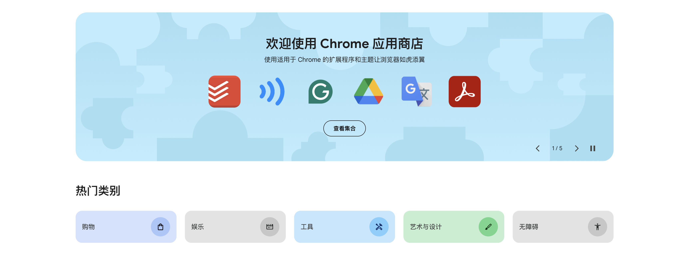

---
# You can also start simply with 'default'
theme: seriph
# random image from a curated Unsplash collection by Anthony
# like them? see https://unsplash.com/collections/94734566/slidev
background: https://cover.sli.dev
# some information about your slides (markdown enabled)
title: 了解和开发一个浏览器扩展程序
# apply unocss classes to the current slide
class: text-center
# https://sli.dev/features/drawing
drawings:
  persist: false
# slide transition: https://sli.dev/guide/animations.html#slide-transitions
transition: slide-left
# enable MDC Syntax: https://sli.dev/features/mdc
mdc: true
# take snapshot for each slide in the overview
overviewSnapshots: true
---

# 了解和开发一个浏览器扩展程序

<div class="pt-12">
  <span @click="$slidev.nav.next" class="px-2 py-1 rounded cursor-pointer" hover="bg-white bg-opacity-10">
    Press Space for next page <carbon:arrow-right class="inline"/>
  </span>
</div>

<div class="abs-br m-6 flex gap-2">
  <button @click="$slidev.nav.openInEditor()" title="Open in Editor" class="text-xl slidev-icon-btn opacity-50 !border-none !hover:text-white">
    <carbon:edit />
  </button>
  <a href="https://github.com/slidevjs/slidev" target="_blank" alt="GitHub" title="Open in GitHub"
    class="text-xl slidev-icon-btn opacity-50 !border-none !hover:text-white">
    <carbon-logo-github />
  </a>
</div>

<!--
The last comment block of each slide will be treated as slide notes. It will be visible and editable in Presenter Mode along with the slide. [Read more in the docs](https://sli.dev/guide/syntax.html#notes)
-->

---

# 目录

<Toc columns="2" />

---

[Chrome 浏览器扩展程序商店](https://chromewebstore.google.com)



---
layout: center
---

# 扩展程序都可以扩展什么？

---

1. 增强额外交互，每个插件都会展示在右上部分，您可以设置其收起或展开展示插件图标，点击图标时会展示插件提供的 popup 弹出窗口，比如 [天气 - Weather](https://chromewebstore.google.com/detail/%E5%A4%A9%E6%B0%94-weather/ibieofighcnndjcjchdahdiacjpmkhgf) 直接图标展示今日天气，点击展开弹出窗口查看更多信息
2. 增强 Tab 页，新增或删除内容，比如 [DeepL](https://chromewebstore.google.com/detail/deepl%EF%BC%9A%E4%BA%BA%E5%B7%A5%E6%99%BA%E8%83%BD%E7%BF%BB%E8%AF%91%E5%99%A8%E5%92%8C%E5%86%99%E4%BD%9C%E5%8A%A9%E6%89%8B/cofdbpoegempjloogbagkncekinflcnj) 可以划词就地翻译展示，弹出窗口并不是当前访问页面所构建的，而是由插件创建并插入进当前页面的
3. 增强右键工具栏，访问任何页面都可以右键操作浏览器，可以在此新增快捷操作
4. 增强地址栏输入，新增快捷访问等
5. 定制新标签页，可以替换浏览器打开新标签页，自定义任何内容，比如 [Clear New Tab](https://chromewebstore.google.com/detail/clear-new-tab/felphkbfjadmcejnibcmcncimlappdde) 可以替换默认新标签页，替换为一个简洁的空白页
6. 增强开发者工具，比如 [Redux DevTools](https://chromewebstore.google.com/detail/redux-devtools/lmhkpmbekcpmknklioeibfkpmmfibljd) 可以查看 Redux 应用的 state
7. ...

---
layout: center
---

# 如何开发插件

---

提供一个插件目录给到浏览器加载即可，而一个插件目录包括 [manifest.json](https://developer.chrome.com/docs/extensions/reference/manifest) 配置文件

最小清单内容：

```json
{
  "manifest_version": 3,
  "name": "Extension Name",
  "description": "Extension Description",
  "version": "1.0.0"
}
```

而插件可以增强浏览器各方面功能，都在 manifest.json 中进行声明

「以下所以均基于 Chrome 浏览器，其他浏览器大同小异」

---
src: ./pages/popup.md
---

---
src: ./pages/service-worker.md
---

---
src: ./pages/message.md
---

---
src: ./pages/content-script.md
---

---
src: ./pages/omnibox.md
---

---
src: ./pages/context-menu.md
---

---
src: ./pages/extension-more.md
---

---
src: ./pages/security.md
---

---
src: ./pages/demo.md
---

---
src: ./pages/publish.md
---

---
layout: center
---

# Thanks
